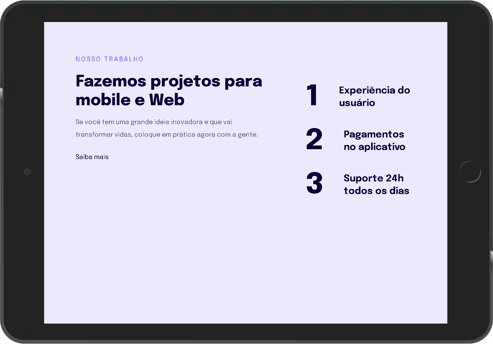

<h1 align="center">
	Explorer-Stage03-Responsividade
</h1>

<h3 align="center">
	Projeto desenvolvido na  formação explorer da rocketseat
</h3>&nbsp;

	
	

<h4 align="center">
	Status: 🚀 Finished
</h4>

	<a href="#sobre">Sobre</a> •
	<a href="#funcionalidades">Funcionalidades</a> •
	<a href="#tecnologias">Tecnologias</a> •
	<a href="#autor">Autor</a> 

## Sobre

Projeto simples de uma página que foca em conceitos de responsividade, configuração de página para mobile first, conform o dispositivo que é acessado a página se adapta para versão desktop

## Funcionalidades

- [x] Configurado para dispositivos mobile
- [x] Adaptação para dispositivos maiores(Tablets e desktop)

## Tecnologias

&nbsp;
&nbsp;

## Imagens

	|		|

## Autor

Criado por [Willian Amaro Gomes](https://github.com/williangomesdev)

&nbsp;
&nbsp;
 
